# Digital Library Management System


## Project Contribution

This project was developed as part of a **team collaboration**.  
Within the team, I coordinated the development process by organizing the tasks, distributing responsibilities among team members, and ensuring that each component of the application was properly implemented.  
After the implementation phase, I performed a comprehensive review of the entire system, testing the application's functionality and identifying potential issues in both the frontend and backend. I corrected errors and ensured that all components were correctly integrated and functioning as expected.


<p align="center">
  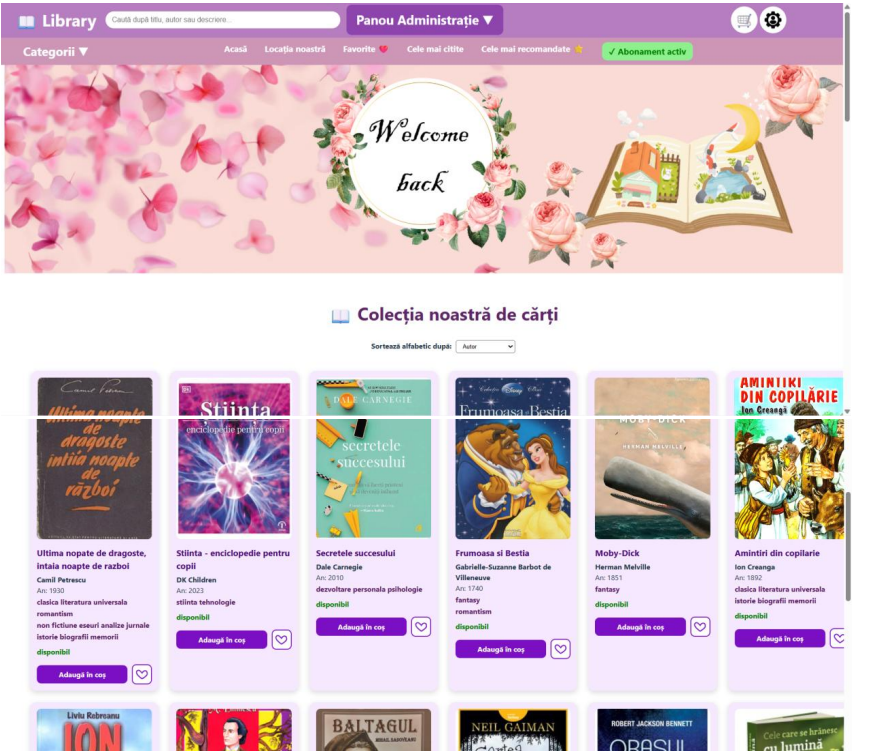
</p>


## Description

The **Digital Library Management System** is a full-stack web application designed to manage a modern digital library.  
The platform allows users to browse books, reserve and borrow items, manage personal accounts, rate books, and maintain a list of favorite titles.  
The system also includes an **administrative interface** that allows managers to manage books, approve subscriptions, and monitor library activity.  
The application is built using a **React frontend** and a **Spring Boot backend**, communicating through REST APIs.

## System Architecture

The system follows a **three-tier architecture**:

```
Client Layer
(React + TypeScript)
        |
REST API Layer
(Spring Boot)
        |
Persistence Layer
(MySQL Database)
```

## Application Screenshots

### Home Page

<p align="center">
  
</p>

### Account Details

<p align="center">
  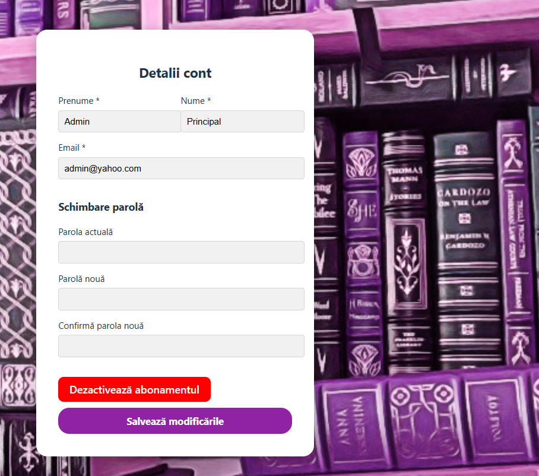
</p>

### Book Details

<p align="center">
  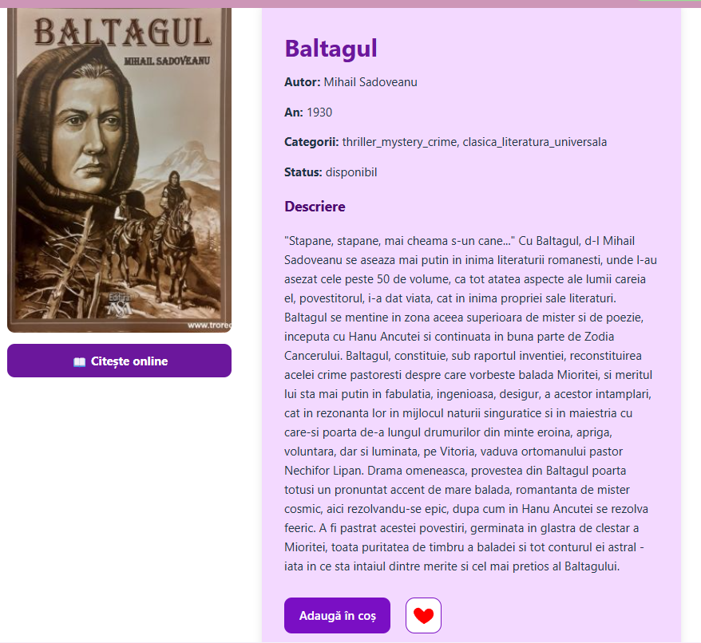
</p>


### Categories

<p align="center">
  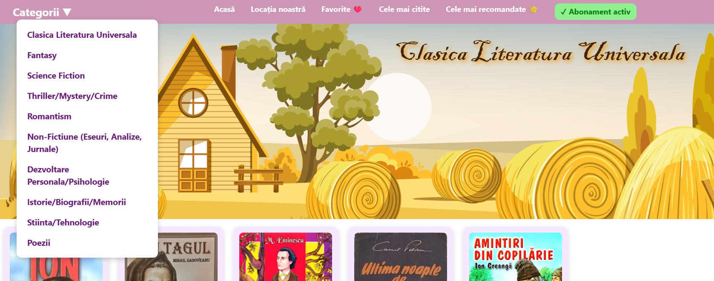
  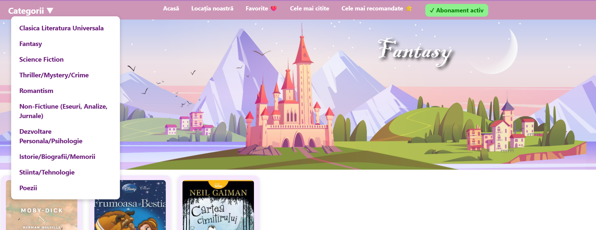
  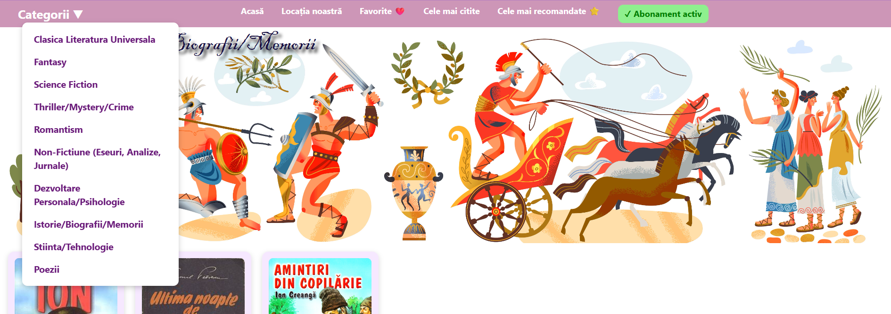
</p>


### Favorites Page

<p align="center">
  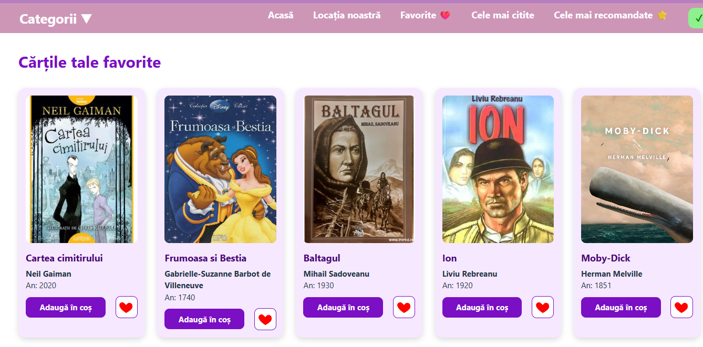
</p>


### Cart

<p align="center">
  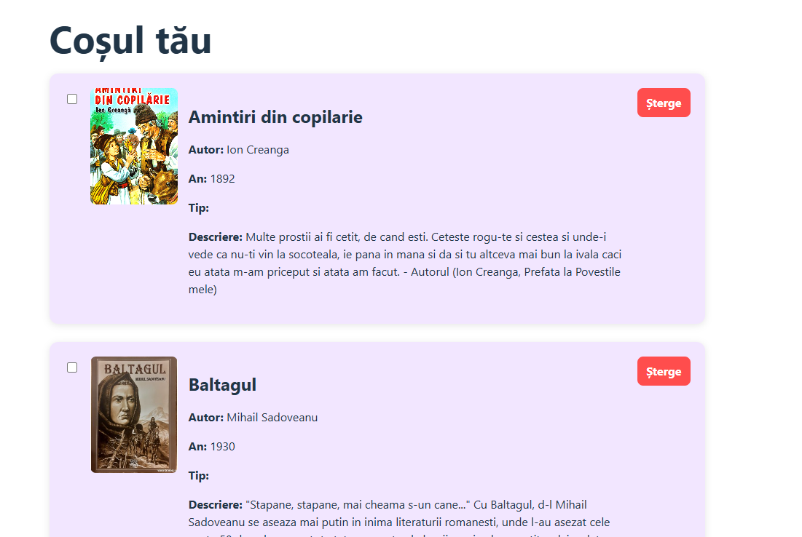
</p>


### Borrow History

<p align="center">
  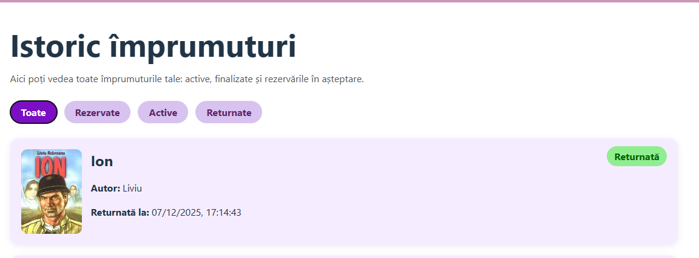
</p>


### Admin Panel

<p align="center">
  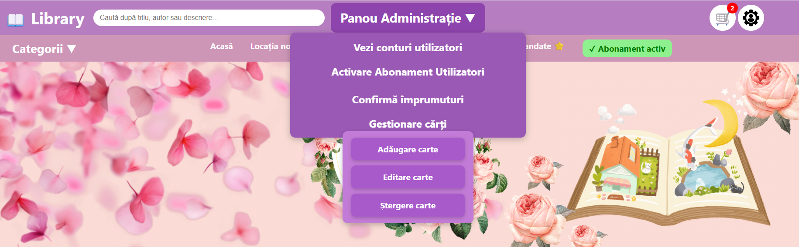
</p>


### Library Location

<p align="center">
  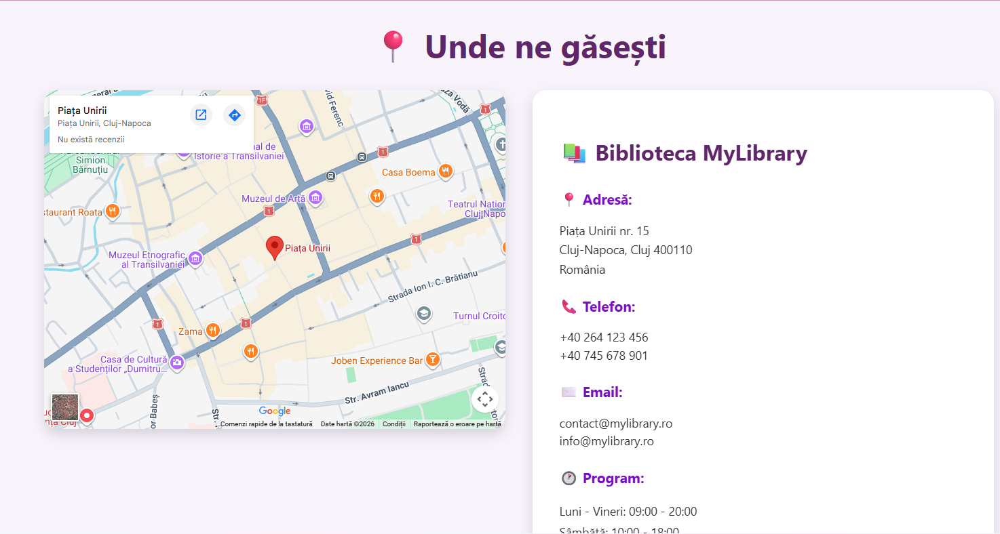
  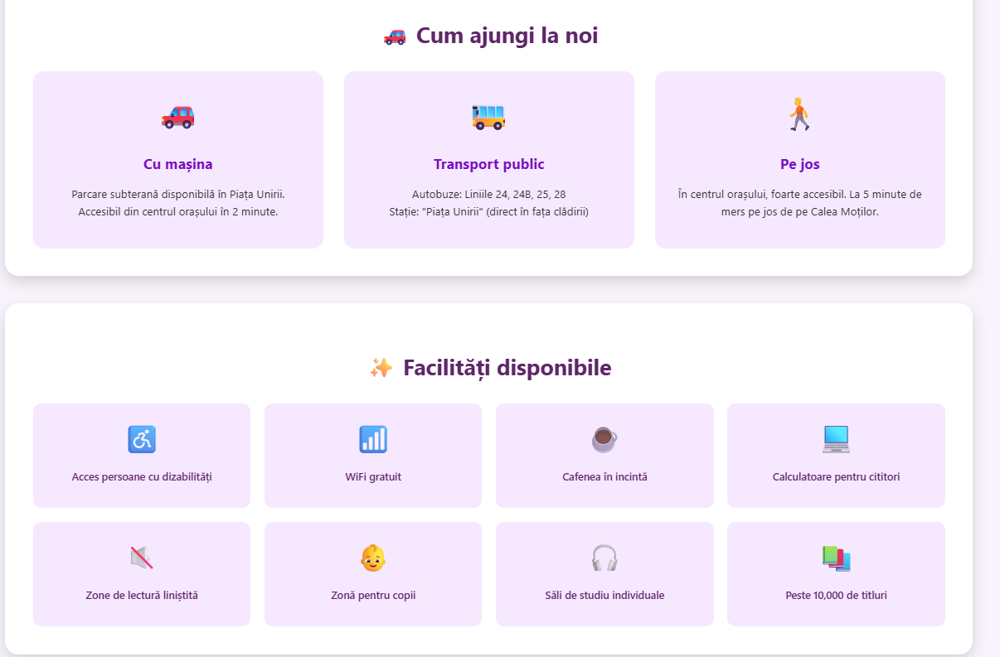
</p>


### Most Read

<p align="center">
  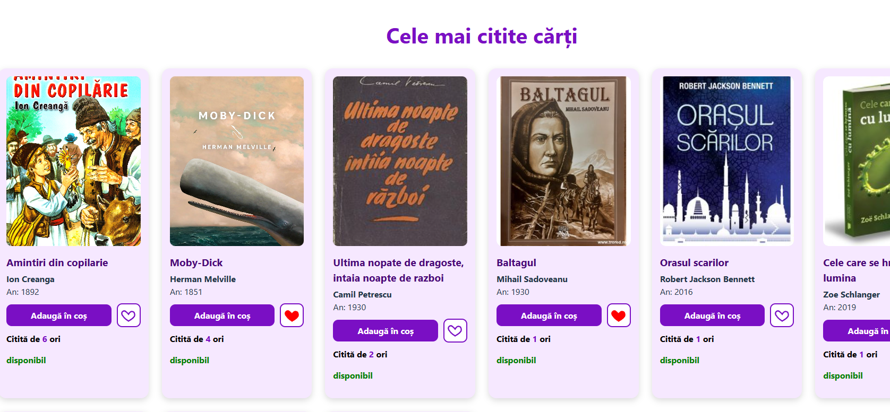
</p>


### Recommended Books

<p align="center">
  
</p>


### Terms and Conditions

<p align="center"> 
  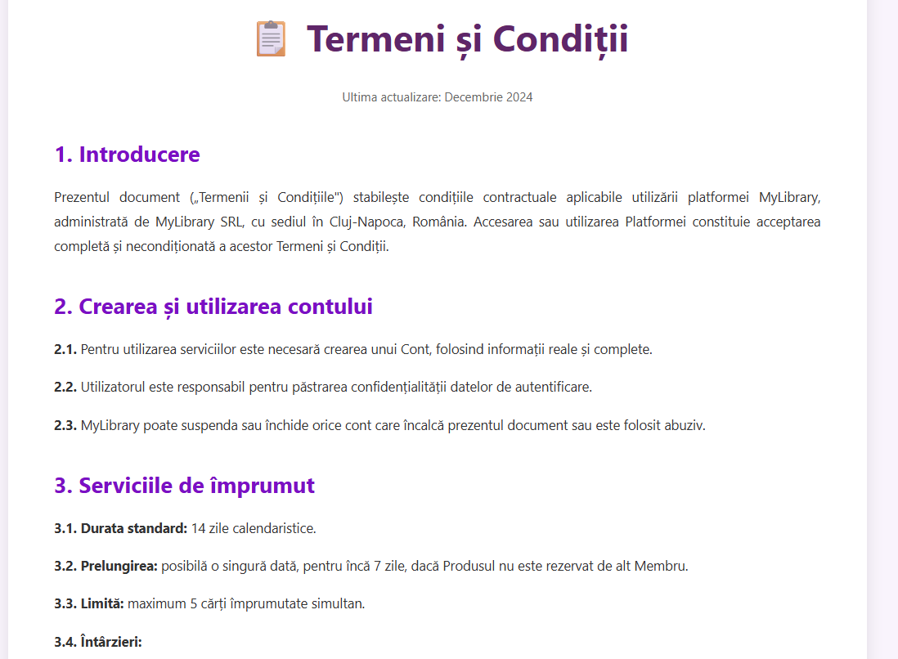
</p>


## Main Features

### User Features
- User registration and authentication
- Browse the digital book catalog
- Search books by title, author or description
- Filter books by category
- View detailed information about each book
- Add books to favorites
- Borrow and reserve books
- View borrowing history
- Return books
- Rate books after returning them
- View top rated and most read books
- Manage personal account
- Request subscription activation
- Read books online if the subscription is activated

### Admin Features
- Add new books
- Edit existing books
- Delete books
- Manage book inventory
- View all users
- Approve subscription requests
- Deactivate subscriptions
- Monitor borrowing activity


## Use Case Diagram

The following diagram illustrates the main actors and functionalities of the digital library system, including interactions between visitors, users, and administrators.

<p align="center">
  
</p>

## Design Patterns
### Observer Pattern

One of the patterns incorporated in this project is the **Observer Pattern**, which manages updates between different components of the system.  
The Observer pattern allows objects (observers) to automatically react when the state of another object (the subject) changes. This approach helps decouple system components and improves maintainability.

The diagram below illustrates the structure of the Observer Pattern used in the application:
<p align="center"> 
  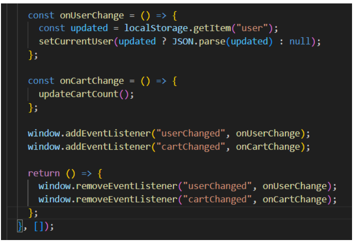
</p>

In the context of this project, the pattern can be used to notify different parts of the system when specific events occur, such as:

- changes in book availability
- updates in borrowing status
- subscription status changes
- updates to user-related data

By using this pattern, the system ensures that relevant components are automatically updated when important events occur, without creating strong dependencies between modules.


## System Design Documentation

As part of the system design phase, several **UML diagrams** were created to model the behavior and structure of the application.

### Sequence Diagrams

Sequence diagrams illustrate the **interaction between system components over time**, showing how requests move through the frontend, backend controllers, services, and database.

<p align="center">
  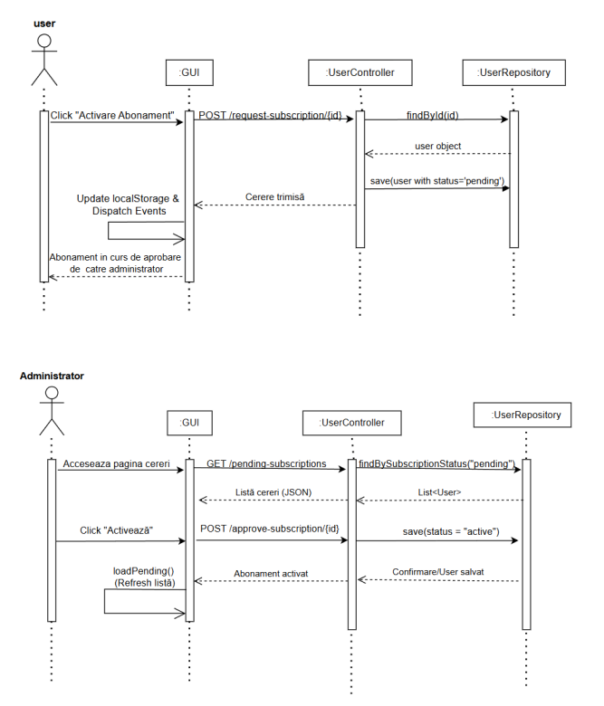
</p>


### Communication Diagrams

Communication diagrams describe how **different components of the system interact with each other** and how messages are exchanged between objects.

<p align="center">
  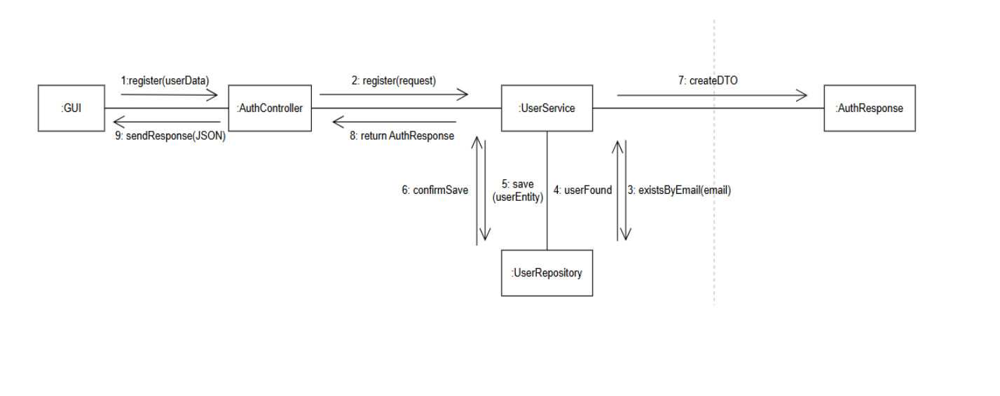
</p>


### State Diagrams

State diagrams illustrate how an object changes its **state during its lifecycle**.  
These diagrams help represent how the system transitions between states depending on user actions or system events.

<p align="center">
  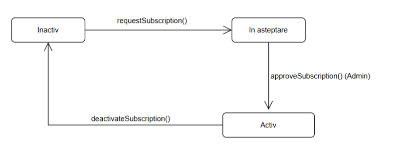
</p>


## Backend Architecture

The backend follows a **layered architecture pattern**.

```
controller
service
repository
model
dto
strategy
```

### Controller Layer

Controllers expose REST endpoints used by the frontend.

Main controllers include:

```
AuthController
BookController
BorrowController
FavoriteController
RatingController
UserController
```

These controllers handle HTTP requests and delegate business logic to the service layer.

### Service Layer

The service layer contains the core **business logic** of the application.

Main services include:

```
BookService
BorrowService
UserService
```

Examples of responsibilities:

BookService
- manage book inventory
- add/edit/delete books
- validate availability

BorrowService
- borrow books
- reserve books
- confirm reservations
- return books
- generate borrowing statistics

UserService
- user authentication
- registration
- subscription management


### Repository Layer

The repository layer interacts with the database using **Spring Data JPA**.

Repositories include:

```
BookRepository
BorrowRepository
FavoriteRepository
RatingRepository
UserRepository
```

These repositories provide CRUD operations and custom queries.


## Database Design
```
User
 ├── id
 ├── firstName
 ├── lastName
 ├── email
 ├── password
 ├── role
 └── subscriptionStatus

Book
 ├── id
 ├── title
 ├── author
 ├── description
 ├── categories
 ├── stock
 └── status

Borrow
 ├── id
 ├── userId
 ├── bookId
 ├── borrowDate
 ├── returnDate
 ├── reservationDate
 ├── dueDate
 └── status

Favorite
 ├── id
 ├── userId
 └── bookId

Rating
 ├── id
 ├── userId
 ├── bookId
 └── rating
```


## Frontend Architecture

The frontend is built using **React with TypeScript**.

Main pages include:

```
Home
Login
Register
BookDetail
CategoryPage
Favorite
Borrow
BorrowHistory
ReturnBooks
AccountDetails
TopRated
MostRead
LibraryLocation
TermsAndConditions
```

Each page communicates with the backend through REST APIs.


## Project Structure

```
digital-library
│
├── backend                          # Spring Boot backend application
│   │
│   ├── src
│   │   ├── main
│   │   │   ├── java
│   │   │   │   └── com.example.backend
│   │   │   │       ├── config        # Configuration classes
│   │   │   │       ├── controller    # REST API controllers
│   │   │   │       ├── dto           # Data Transfer Objects
│   │   │   │       ├── model         # Database entities
│   │   │   │       ├── repository    # JPA repositories
│   │   │   │       ├── service       # Business logic
│   │   │   │       ├── strategy      # Sorting strategies (Strategy Pattern)
│   │   │   │       └── BackendApplication.java       # Spring Boot main application
│   │   │   │
│   │   │   └── resources             # Application configuration files
│   │   │
│   │   └── test                      # Backend tests
│   │
│   ├── uploads                       # Uploaded files (book images / PDFs)
│   └── pom.xml                       # Maven configuration  
│
├── frontend                          # React + TypeScript frontend
│   │
│   ├── public                        # Static files
│   ├── src
│   │   ├── assets                    # Images and other static assets
│   │   ├── fonts                     # Custom fonts
│   │   ├── pages                     # Application pages/components
│   │   ├── App.tsx                   # Main React component
│   │   ├── main.tsx                  # Application entry point
│   │   ├── App.css
│   │   └── index.css
│   │
│   ├── index.html
│   ├── package.json
│   ├── tsconfig.json
│   └── vite.config.ts                # Vite configuration
│
├── images                            # Screenshots used in README
│
├── Baza_de_date_1.sql                # Database schema / initial data
│
├── Biblioteca_digitala.pdf
└── README.md
```


## Installation

### Backend

```
cd backend
mvn spring-boot:run
```

Backend runs on:

```
http://localhost:8080
```

## Frontend

```
cd frontend
npm install
npm run dev
```

Frontend runs on:

```
http://localhost:5173
```

# Future Improvements

Possible improvements include:

- JWT authentication
- Email notifications
- Advanced recommendation system
- Admin analytics dashboard
- Mobile optimization
- Book reservation expiration notifications


## Author
Francesca Lara Szarka  
Computer Science Student  
Technical University of Cluj-Napoca


